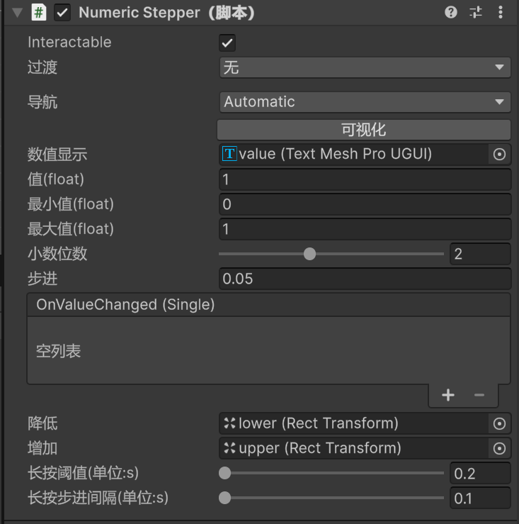

### NumericStepper数值步进

#### 描述
NumericStepper用左右两个按钮控制一个数值加减，并实时显示在中间的文本框里

#### 属性

|属性|类型|含义|
|:-: |-|-  |
|Interactable|`bool`|控制控件是否可交互|
|数值显示||实时显示数值的那个文本框，为TextMeshPro|
|Value|`float`|该组件控制的数值|
|MinValue|`float`|Value的最小值|
|MaxValue|`float`|Value的最大值|
|步进|`float`|一次加减Value变化多少|
|小数位数|`int`|步进值的小数位数，可以理解为精度，最高5位|
|降低|`RectTransform`|数值减小按钮所在的物体|
|增加|`RectTransform`|数值增加按钮所在的物体|
|长按阈值|`float`|长按多少秒之后判定为长按，否则判定为单击|
|长按步进间隔|`float`|如果进入长按，多少秒数值变化一次|

#### 细节
1. 该控件有一个父物体，三个子物体，分别是lower、value、upper
2. lower和upper都是一个`Button`，分别控制数值的加减；
3. lower和upper上带有`Image`，可自行替换贴图；
4. value是一个`TextMeshPro`，可自由编辑；
5. 您也可以给value拖一个别的`TextMeshPro`；
6. 以upper增加按钮为例，“长按阈值”（下称t）和“长按步进间隔”（下称delta）的意思是，按下按钮的瞬间触发一次数值增加，如果按住增加按钮的持续时间小于t秒，那么会判定为单击，不再触发新的数值增加，如果按住的时间超过t秒，那么判定为长按，此时每经过delta秒数值增加一次；
7. 小数位数和步进：举个例子，小数位数设置为2，步进设置为0.01，那么数值以0.01为单位变化，但如果步进值的小数位数更高，比如说此时步进值设置为0.011，那么会四舍五入到0.01；
8. 该组件上有一个OnValueChanged事件，当数值变化时会响应，编辑方式与unity的Slider控件一致；