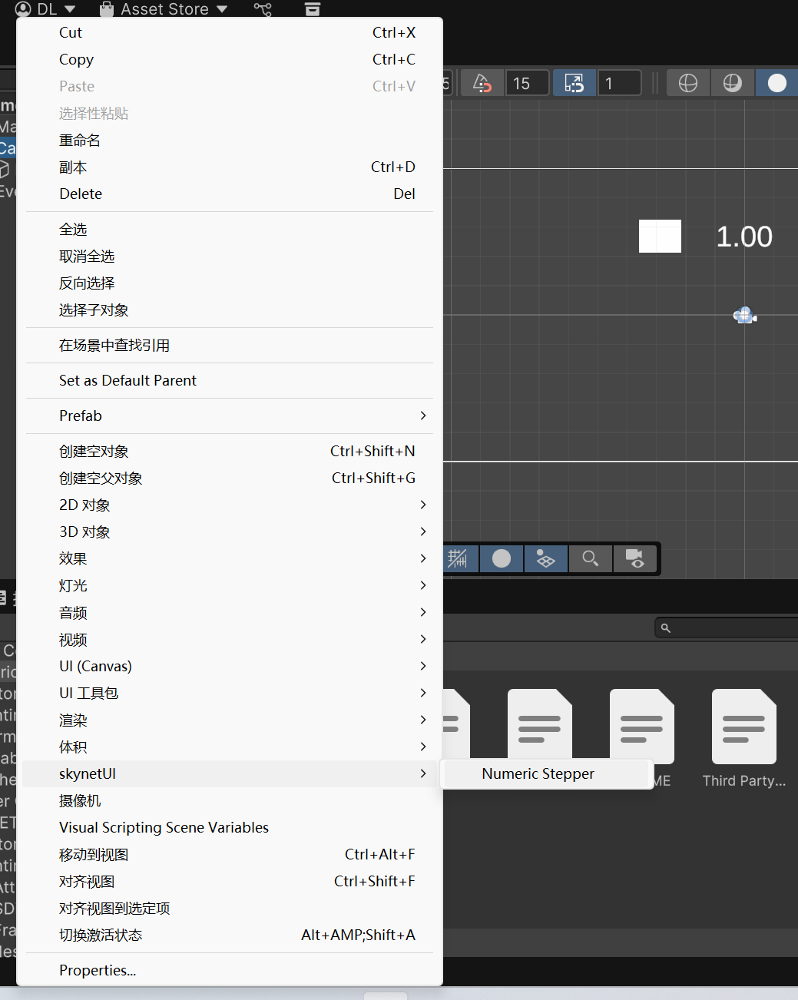
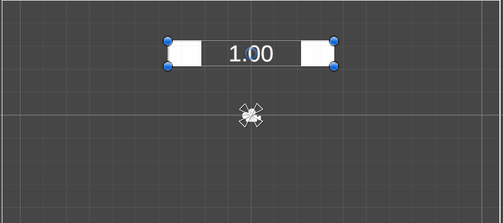

# NumericStepper

unity官方没有数值调节器，比较接近的是Slider滑条。正好自己的项目需要，手写了一个NumericStepper小控件，用左右两个按钮加减数值，并实时显示在中间。

## 安装
NumericStepper脚本里需要引用[InspectorLabel](https://github.com/skynetXDU/SKYNET2/blob/master/Documentation~/InspectorLabel.md)，所以需要先安装[这个包](https://github.com/skynetXDU/SKYNET2)，之后依次执行：
1. unity编辑器中，点击Window - Package Management - Package Manager；
2. 弹出的窗口中点左上角的“+”号，选Install package from git URL，弹出的输入框里输入<https://github.com/skynetXDU/NumericStepper.git>，点右侧Install等待安装即可；

## 主要功能

1. 用左右两个按钮控制数值加减；
2. 数值实时显示在中间；
3. 可配置最大值、最小值；
4. 数值按配置的步进值增减；
5. 最高精度5位小数
6. 可以像Slider那样订阅事件
7. 支持一键创建NumericStepper

## 1️⃣个示例

首先新建一个canvas，然后在canvas下右击，弹出的菜单选SkynetUI->NumericStepper，即可创建一个该组件；
创建好组件后可以进到lower和upper子物体下替换贴图，也可以更换文本框字体；

